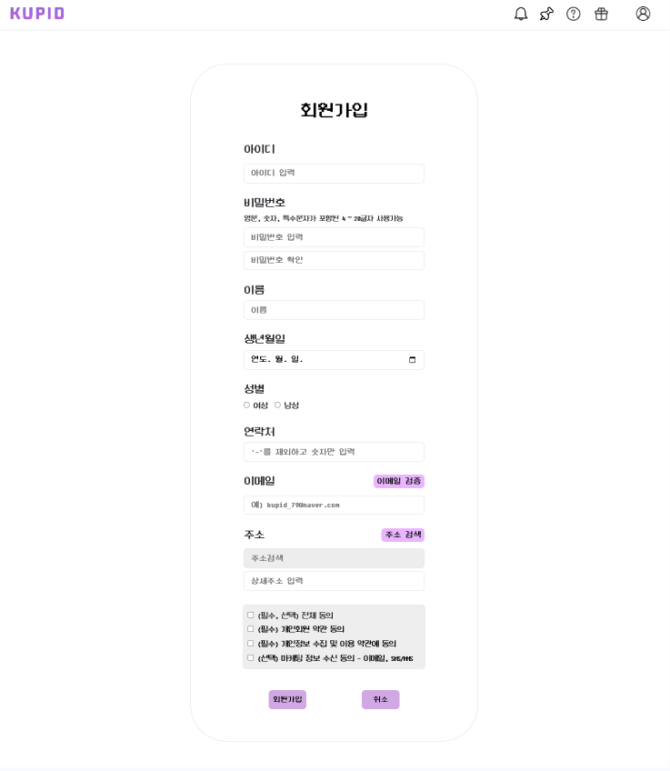

# KUPID(K-POP ARTIST 소셜 커뮤니티 사이트)

* 스프링 부트와 같은 프레임 워크를 사용하지 않고 구현한 프로젝트
* K-POP 아티스트와 팬의 소통 커뮤니티
* KUPID = 서로를 이어준다는 의미로 K-POP + CUPID의 합성어

## 프로젝트 개요

- 개발기간: 2024-05-20 ~ 2024-05-31
- 개발인원: 총 4명

| 팀장 | 팀원 | 팀원 | 팀원 | 팀원 | 팀원 |
| --- | --- | --- | --- | --- | --- |
| [박진형](https://github.com/JinHyung-dev) | [김혜정](https://github.com/kimhyejeongd) | [이기수](https://github.com/Kisoo123) | [이우석](https://github.com/lws9) |

## 목적 및 기대효과

- 자신의 관심 아티스트와의 소통, 공식 일정 및 영상 확인 기능 제공
- 아티스트의 팬들 간의 소통 기능 제공
- 새로운 아티스트를 탐색하고 알아볼 수 있는 기능 제공

새로운 아티스트를 알아가거나 자신이 구독한 아티스트와 소통할 수 있는 온라인 서비스를 제공하고자 하였다.

## 개발 환경 및 사용 기술
#### 개발 환경

#### 데이터베이스
  
#### 서버

#### 개발 언어

#### 사용 기술

#### 라이브러리 & 프레임워크
 
 
 
 

#### API

#### 도구

## ERD
회원, 구독, 신고, 주문, 피드, 댓글, 좋아요 등 총 22개의 테이블로 구성

## 와이어프레임 & 디자인

## 프로젝트 기능
메인화면, 회원가입, 로그인, 마이페이지, 아티스트 페이지, 피드, 고객센터, 관리자 페이지
### 메인화면
<table>
  <tr>
    <td style="vertical-align: top;"> 
       </td>
    <td style="vertical-align: top;">
<b>상단 배너</b> 

- 현재 이벤트 중인 배너 노출(회전)됩니다.

**구독 아티스트 / 전체 아티스트 출력**

- 구독 아티스트 카드 클릭시 아티스트 커뮤니티로 이동합니다.
- 구독하지 않은 아티스트 카드 클릭시 해당 아티스트 페이지로 이동합니다.

**아티스트 검색**

- 등록된 모든 아티스트 그룹의 이름을 검색하여 입력값이 포함된 아티스트 조회
  
</td>
  </tr>
</table>

### 회원가입
<table>
  <tr>
    <td style="vertical-align: top;"> 
       </td>
    <td style="vertical-align: top;">
<b>입력값 유효성 검증</b> 

- 사용자가 입력한 입력값을 검증하고 필수 정보가 없으면 회원가입 요청이 전송되지 않습니다.
- 입력값을 검증하여 특수문자 오입력을 방지합니다.
- 비밀번호 입력란의 값을 확인하고 생성 규칙에 부합하는지 확인하고 결과를 출력합니다.
- 비밀번호 확인란의 값을 확인하고 일치 여부를 확입합니다.
</td>
  </tr>
  <tr>
    <td style="vertical-align: top;"> 
       </td>
    <td style="vertical-align: top;">
<b>이메일 검증</b> 

- 입력한 이메일 값으로 인증 메일을 발송하고, 인증번호를 받습니다.
- 인증이 완료되면 수정이 불가능하도록 바뀝니다.
</td>
  </tr>
  <tr>
    <td style="vertical-align: top;"> 
       </td>
    <td style="vertical-align: top;">
<b>주소검증</b> 

- 주소는 직접 작성할 수 없도록 되어있으며 주소 검색 api 팝업으로 주소를 선택한 값으로 채워집니다..
</td>
  </tr>
</table>

### 로그인
<table>
  <tr>
    <td style="vertical-align: top;">  </td>
    <td style="vertical-align: top;">
<b>아이디 저장</b> 

- 브라우저 쿠키에 로그인 성공했던 아이디를 저장하여 다음 로그인시 저장된 아이디로 자동 완성됩니다.

**소셜 로그인**

- 카카오 api를 활용하여 카카오톡으로 로그인하거나 계정정보를 입력받아 회원 인증을 진행합니다.
- 회원 db를 조회하여 동일한 카카오 계정으로 이미 가입된 회원이면 로그인이 바로 진행되며, 가입되지 않은 회원이면 회원가입 화면으로 이동합니다.
</td>
  </tr>
</table>

### 마이페이지
<table>
  <tr>
    <td style="vertical-align: top;">  </td>
    <td style="vertical-align: top;">
<b>내 프로필</b> 

- 회원의 프로필 사진과 닉네임, 소개 정보, 구독한 아티스트 확인 및 수정 가능합니다.
- 사진 변경을 통해 로컬에서 선택한 사진으로 회원 사진을 변경할 수 있습니다.
- 닉네임은 중복 확인을 위해 DB 회원 테이블의 닉네임 컬럼을 조회하고 중복값이 없어야 수정 가능합니다.
</td>
  </tr>
  <tr>
    <td style="vertical-align: top;">  </td>
    <td style="vertical-align: top;">
<b>내 정보</b> 

- 아이디를 제외하고 이름, 비밀번호, 연락처, 이메일, 주소를 변경할 수 있습니다.
- 이메일 검증을 통해 새로운 이메일 주소로 인증번호를 발송받고 인증하여야 최종 수정이 완료됩니다.
</td>
  </tr>
  <tr>
    <td style="vertical-align: top;">  </td>
    <td style="vertical-align: top;">
<b>내 활동</b> 

- 자신이 아티스트 피드에 남긴 글 조회, 수정, 삭제가 가능합니다.
- 해당 글의 댓글 수와 좋아요 수를 함께 확인할 수 있습니다.
</td>
  </tr>
</table>

### 아티스트 페이지
<table>
  <tr>
    <td style="vertical-align: top;">  </td>
    <td style="vertical-align: top;">
      <ul>
        <li>화면 상단 아티스트 대표 영상 노출</li>
        <li>플로팅 버튼 클릭을 통해 해당 아티스티의 멤버십 가입과 구독 가능</li>
      </ul>
</td>
  </tr>
  <tr>
    <td style="vertical-align: top;">  </td>
    <td style="vertical-align: top;">
      <ul>
        <li>아티스트 그룹에 대한 설명과 멤버별 프로필을 통한 설명</li>
        <li>해당 아티스트의 공식 미디어 영상 노출</li>
      </ul>
</td>
  </tr>
  <tr>
    <td style="vertical-align: top;">  </td>
    <td style="vertical-align: top;">
      <ul>
        <li>해당 아티스트 멤버십을 가입한 회원만 멤버십 전용 영상과 아티스트 일정을 자세히 볼 수 있음</li>
        <li>멤버십 가입 버튼 클릭 시, 멤버십 구매 화면으로 이동</li>
        
      </ul>
</td>
  </tr>
</table>

### 피드
<table>
  <tr>
    <td style="vertical-align: top;">
      
    </td>
    <td style="vertical-align: top;">
      <li>해당 아티스트에 대한 피드 글 목록 조회(무한스크롤)</li>
      <li>새로운 피드 글 작성, 댓글 작성, 좋아요 기능</li>
      <li>본인이 쓴 글이 아닌 경우 신고 가능</li>
    </td>
  </tr>
</table>

### 고객센터
<table>
  <tr>
    <td style="vertical-align: top;">  </td>
    <td style="vertical-align: top;">
      <b>고객센터 메인화면</b>
      <ul>
        <li>FAQ, 문의하기 페이지로 연결</li>
      </ul>
</td>
  </tr>
  <tr>
    <td style="vertical-align: top;">  </td>
    <td style="vertical-align: top;">
      <b>카테고리별 FAQ 질문 및 답변 확인</b>
      <ul>
        <li>키워드 검색을 통해 빠른 조회</li>
        <li>카테고리별 FAQ 조회</li>
      </ul>
</td>
  </tr>
  <tr>
    <td style="vertical-align: top;">  </td>
    <td style="vertical-align: top;">
      <b>1:1 문의하기</b>
      <ul>
        <li>파일을 첨부할 수 있는 1:1 문의글 작성</li>
      </ul>
</td>
  </tr>
</table>

### 관리자 페이지
<table>
  <tr>
    <td style="vertical-align: top;">  </td>
    <td style="vertical-align: top;">
      <b>대시보드</b>
      <ul>
        <li>현재 회원 수를 확인</li>
        <li>구글차트 API를 사용하여 동적으로 차트와 숫자가 변화</li>
      </ul>
</td>
  </tr>
  <tr>
    <td style="vertical-align: top;">  </td>
    <td style="vertical-align: top;">
      <b>신고 접수 목록</b>
      <ul>
        <li>신고 접수 내역 확인</li>
        <li>신고회원 아이디,신고 카테고리 검색 기능</li>
        <li>해당 신고의 처리 버튼을 통해 신고 처리 진행</li>
      </ul>
</td>
  </tr>
  <tr>
    <td style="vertical-align: top;">  </td>
    <td style="vertical-align: top;">
    <b>신고 처리</b>
      <ul>
        <li>신고 상세 내용을 확인하고 대상 회원에게 정지,탈퇴,패스 중 패널티를 선택하여 부여</li>
        <li>처리 후 처리날짜와 처리결과가 추가되고 JOB SCHEDUAL과 PROCEDURE를 사용해 정지되면 5일동안 로그인 불가 후 자동으로 다시 사용할 수 있게 됨</li>
      </ul>
</td>
  </tr>
   <tr>
    <td style="vertical-align: top;"> 
       
       </td>
    <td style="vertical-align: top;">
    <b>공지사항 관리</b>
      <ul>
        <li>공지사항을 등록, 수정, 삭제</li>
      </ul>
    </td>
  </tr>
  <tr>
    <td style="vertical-align: top;"> 
       
       
       
    </td>
    <td style="vertical-align: top;">
    <b>아티스트 관리</b>
      <ul>
        <li>아티스트(개인) 또는 그룹(단체) 등록, 수정, 삭제</li>
      </ul>
    </td>
  </tr>
</table>